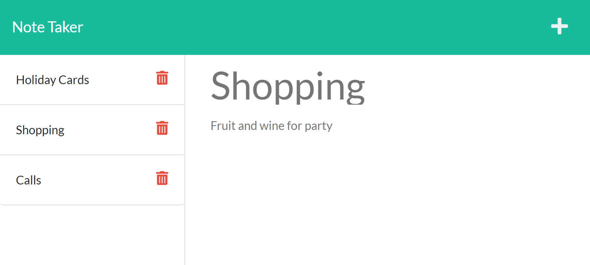

# Note Taker
## Description
This is a browser application for adding, reviewing, and deleting individual notes.
## Table of Contents
- [Installation Instructions](#installation-instructions)
- [Usage Information](#usage-information)
- [Contribution Guidelines](#contribution-guidelines)
- [Test Instructions](#test-instructions)
- [License](#license)
- [Questions](#questions)

## Installation Instructions
All of the folders and files are found in this Github repository: https://github.com/kencford/Note-Taker
## Usage Information
Click on the "Get Started" button on the home page. To add a note, click on the "+" icon in the upper right corner and replace "Note Title" with the your title and replace "Note Text" with your note. To retrieve a note click on its title displayed in the left-side panel. To delete a note, click on the garbage can icon to the right of where it is displayed in the list. 
## Contribution Guidelines
N/A
## Test Instructions
Follow the example as is found on this Heroku-hosted website: https://note-taker-kac.herokuapp.com/
## License

## Questions
### Github account: www.github.com/kencford
### Email: KenCrawford@email.com